# Design Document

## Perscription Management Service Design

## 1. Problem Statement

Pharmacies bear the responsibility of providing medication that has been proscribed to patients by a doctor. Without a proper system to manage incoming prescriptions this could quickly become a nightmare. This is where my application will step in to simplify things. The application should be capable of creating new incoming prescriptions, viewing prescriptions, updating prescriptions, and removing them when a patient picks their prescription up or it expires.

## Definitions
- An 'employee' is a authorized person that works at the pharmacy and is the one who will be doing the data entry for a prescription.
- A 'patient' is the person that recieves the prescription. Not authorized to make changes to the database. Can only view their own "prescriptions"
- A 'prescription' is a single object containing the information regarding the medication to be issued to what person, how much, and for how long.

## 2. Top Questions to Resolve in Review

1. Where do the prescriptions come from? How are they recieved? Doctors write prescriptions for a patient to a pharmacy but how does that dynamic play out here?
2. How and when to introduce the FDA's open API drug data base for drug selection.
3. Are my tables structured in a way that allows me to reach all of my endpoints.

## 3. Use
*Not in rank order*

U0. As a 'employee', I want to be able to view specific 'prescription'.

U1. As a 'employee', I want to be able to view all existing 'prescriptions' for a 'patient'.

U2. As a 'employee', I want to be able to create a new 'prescription' for a 'patient'.

U3. As a 'employee', I want to be able to update a 'prescription' to ready for a 'patient'.

U4. As a 'employee', I want to be able to (soft) delete a 'prescription' when it expires.

U5. As a 'employee', I want to be able to view an existing 'patient'.

U6. As a 'employee', I want to be able to create a new 'patient'.

U7. As a 'employee', I want to be able to update a 'patient's' information.

U8. As a 'employee', I want to be able to delete a 'patient'.

U9. As a 'patient', I want to be able to view all of my active 'prescriptions'.

U10. As a 'patient', I want to be able to view all of my expired 'prescriptions'.

U11. As a 'patient', I want to be able to update my personal information.

U12. As an 'employee', I want to be able to view all 'PENDING' 'prescriptions'

U13. As a 'patient', I want to be able to request a refill of my 'prescription'.


## 4. Project Scope

### 4.1. In Scope

- Viewing, updating, creating, deleting prescriptions are the core of functionality for this application.
- Keeping track of a patient and their information are also an important part of being able to properly and accurately fill prescriptions.
- Two types of users. Employee and Patient. Two different views of the application.

### 4.2. Out of Scope

- The monetary transaction side of things is not to be part of this application.
- Doctor verification. Prescriptions that are being entered are presumed to have been verified and clarified already at this point.


# 5. Proposed Architecture Overview

Minimum Viable Product

U0-U4 will allow the creation, viewing, updating, and deleting of prescriptions.

U5-U8 will allow the creation of a 'patient' profile and store relavant information.

U9-U10 will be for a 'patient' view of their own prescriptions.

U11 will be for a patient to update their own information.

I will use API Gateway and Lambda to create my endpoints for my application.
I will use S3 to store my information.
I will use DynamoDB for my tables of 'prescription' and 'patient' objects.
I will use CloudFront and CloudFormation to create and populate my tables.
I will use Cognito for authorization.

# 6. API

## 6.1. Public Models

```
PrescriptionModel

email - String
prescriptionId - String
drug - String
dose - String
sigCode - String
lastFillDate - DateTime
expirationDate - DateTime
refills - Integer
status - ENUM - PENDING, READY, FILLED, EXPIRED, DELETED
notes - String
```

```
PatientModel

email - String
firstName - String
lastName - String
insurance - String
phone - String
address - String
```

## 6.2. _ViewPrescription Endpoint_

* Accepts `GET` requests to `/prescription/:prescriptionId`
* Accepts a prescription ID and returns the corresponding prescriptionModel.
    * If the given prescription ID is not found, will throw a
      `PrescriptionNotFoundException`


## 6.3 _ViewPrescriptionsForPatient Endpoint_

* Accepts `GET` requests to `/prescription/:email`
* Accepts a patient email and returns the corresponding prescriptionModels.
    * If the given email is not found, will throw a
      `PatientNotFoundException`


## 6.4 _CreatePrescription Endpoint_

* Accepts `POST` requests to `/prescription`
* Accepts a data to create a new prescription and returns the new prescriptionModel.
    * The prescription is an auto generated UUID.
    * The status will default to PENDING.
    * If the given prescription already exists, will throw a
      `DuplicateInventoryItemException`


## 6.5 _UpdatePrescription Endpoint_

* Accepts `PUT` requests to `/prescription/:prescriptionId`
* Accepts a data to update an existing prescription and returns the updated prescriptionModel.
    * If the given prescription ID is not found, will throw a
      `PrescriptionNotFoundException`


## 6.6 _DeletePrescription Endpoint_

* Accepts `DELETE` requests to `/prescription/:prescriptionId`
* Accepts a prescription ID and returns a boolean. True if the prescription was deleted and False if the prescription did not exist or failed to delete.
    * If the given prescription ID is not found, will throw a
      `PrescriptionNotFoundException`


## 6.7 _ViewPatient Endpoint_

* Accepts `GET` requests to `/patient/:email`
* Accepts an email and returns the corresponding PatientModel.
    * If the given patient is not found, will throw a
      `PatientNotFoundException`


## 6.8 _CreatePatient Endpoint_

* Accepts `POST` requests to `/patient`
* Accepts a data to create a new patient and returns the new PatientModel.
    * The email is specific to the patient and acts as the UUID.
    * If the given patient already exists, will throw a
      `DuplicateInventoryItemException`


## 6.9 _UpdatePatient Endpoint_
* Accepts `PUT` requests to `/patient/:email`
* Accepts a data to update an existing prescription and returns the updated PatientModel.
    * If the given email is not found, will throw a
      `PatientNotFoundException`


## 6.10 _DeletePatient Endpoint_

* Accepts `DELETE` requests to `/patient/:email`
* Accepts a email and returns a boolean. True if the patient was deleted and False if the patient did not exist or failed to delete.
    * If the given email is not found, will throw a
      `PatientNotFoundException`


# 7. Tables

```
Name - prescriptions

hash - prescriptionId - S
attribute - email - S
attribute - drug - S
attribute - dose - S
attribute - sigCode - S
attribute - lastFillDate - S
attribute - expirationDate - S
attribute - refills - N
attribute - status - S
attribute - notes - S


GSI - EmailStatusIndex
partition - email
sort - status
attribute - prescriptionId
```

```
Name - patients

hash - email - S
attribute - firstName - S
attribute - lastName - S
attribute - insurance - S
attribute - phone - S
attribute - address - S


GSI - FirstLastIndex
partition - lastName - S
sort - firstName - S
attribute - email - S
```

# 8. Pages

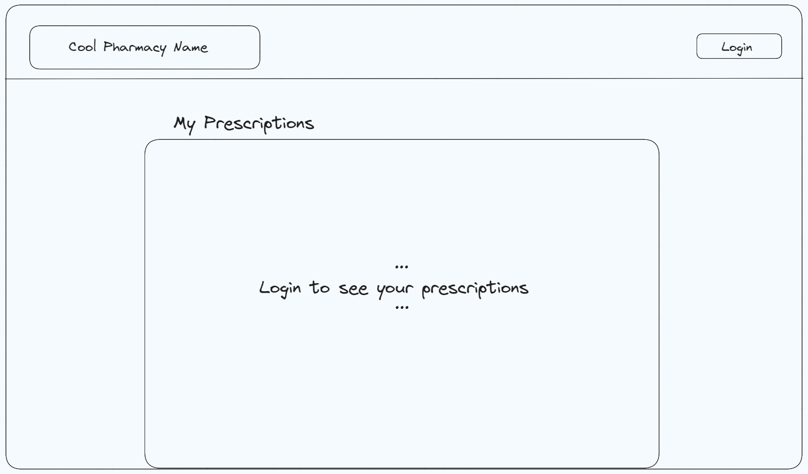
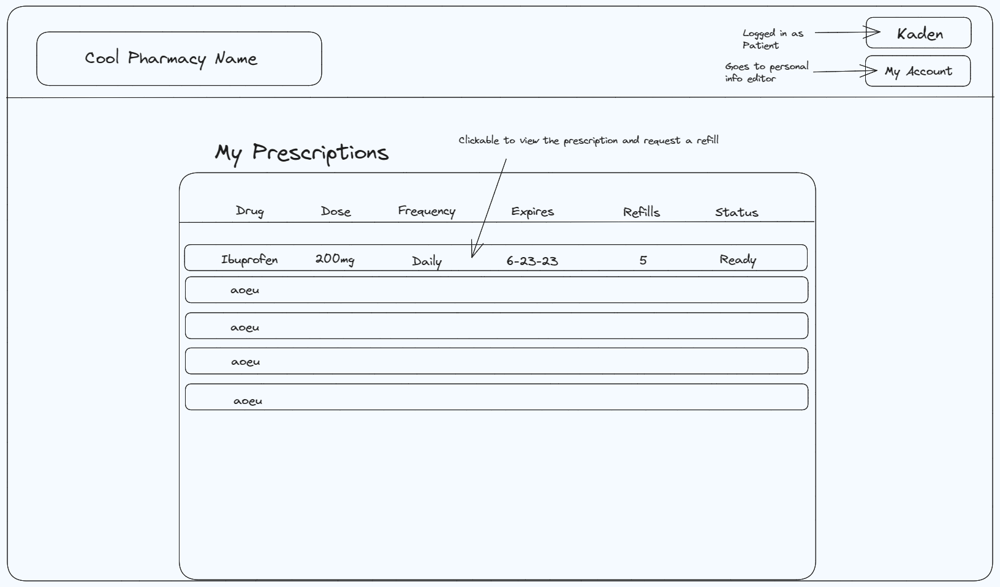
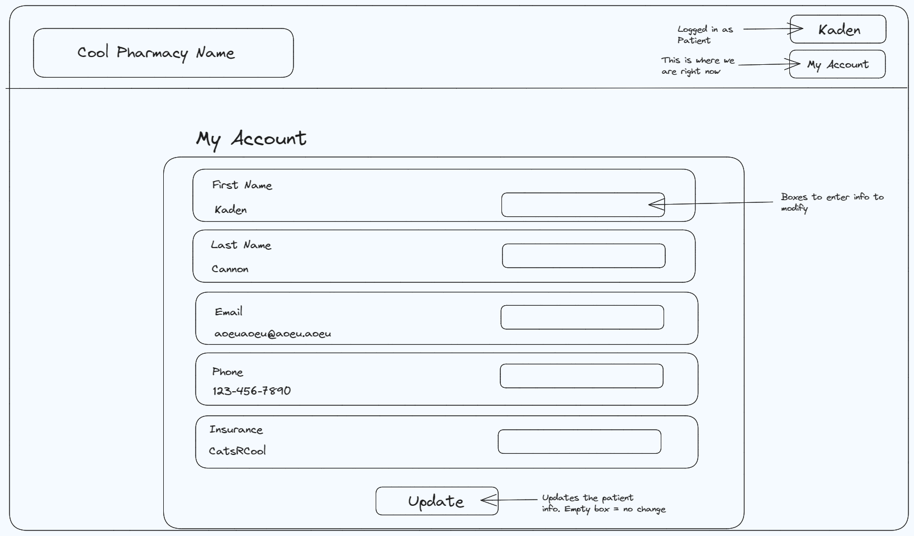
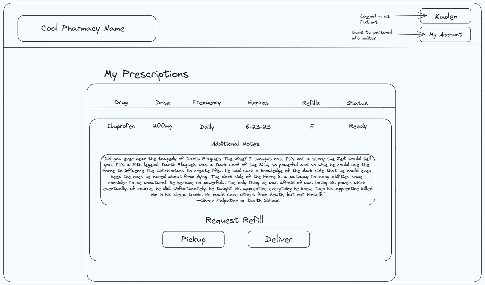
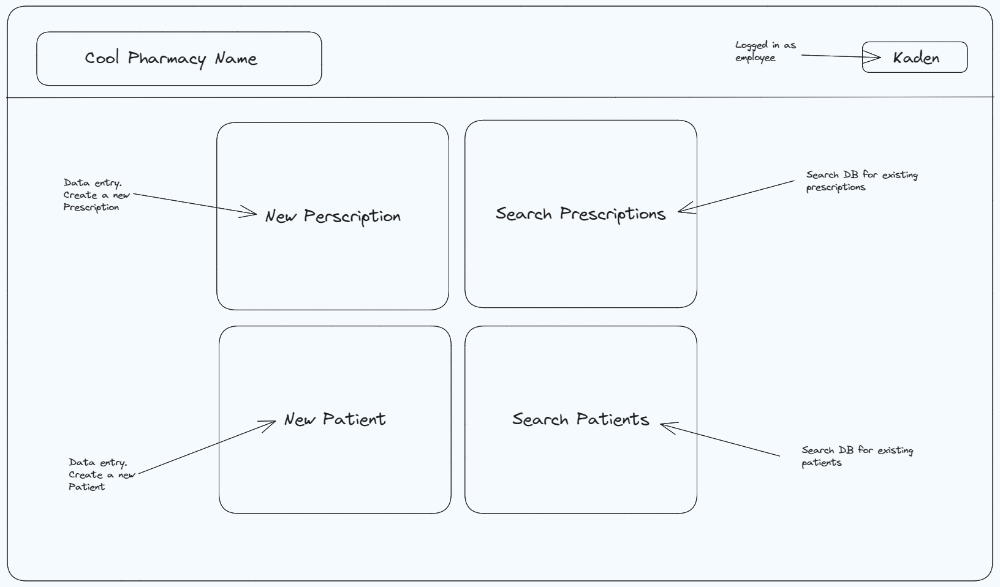
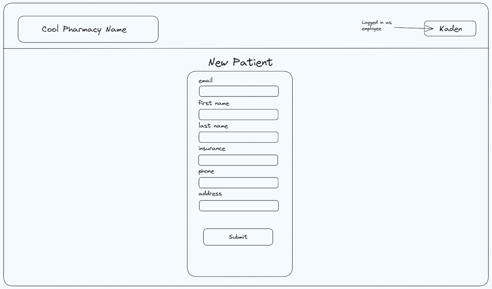
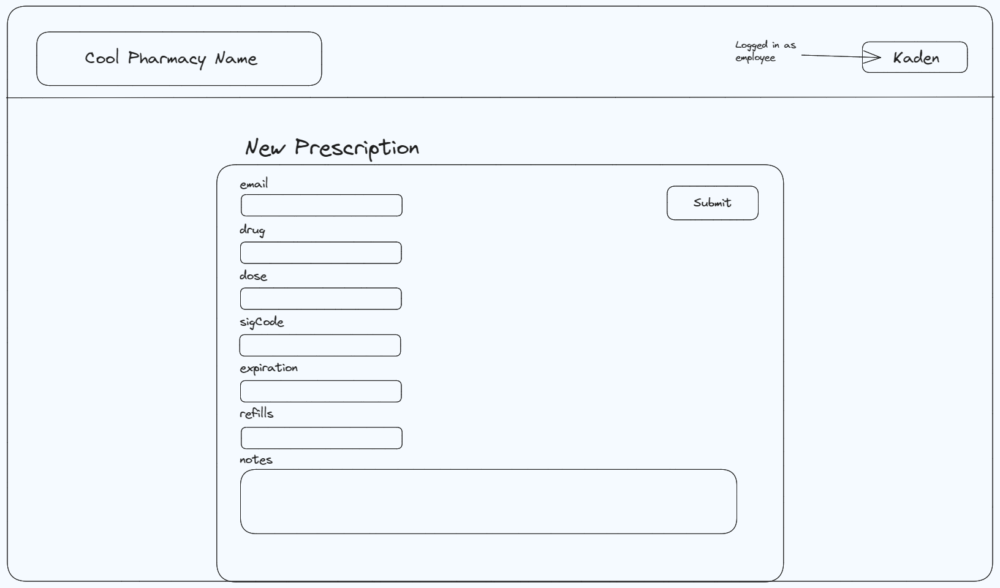
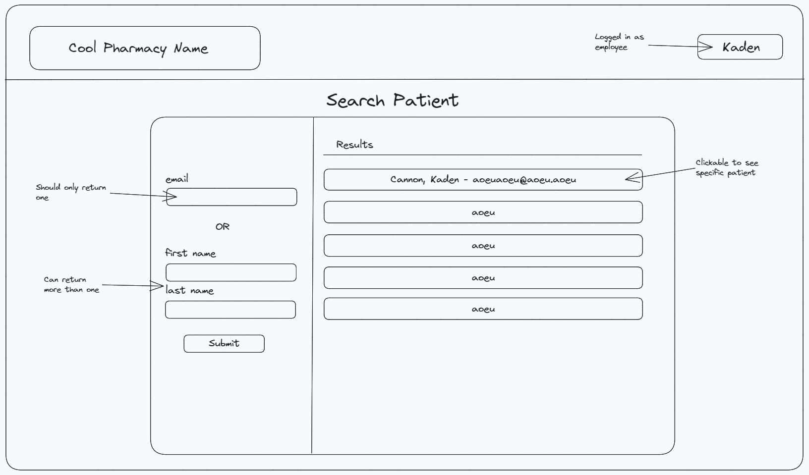
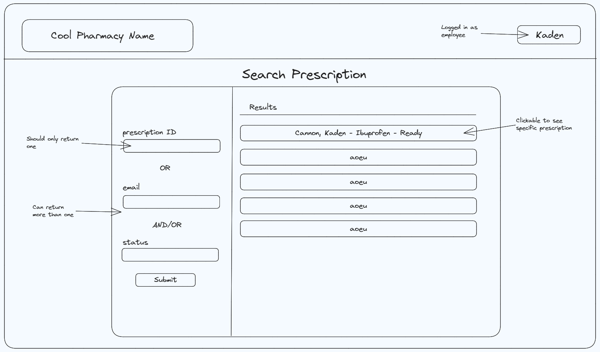
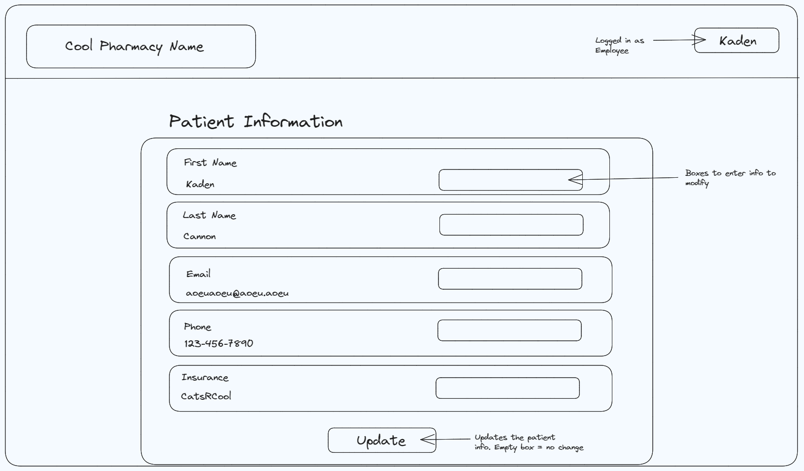
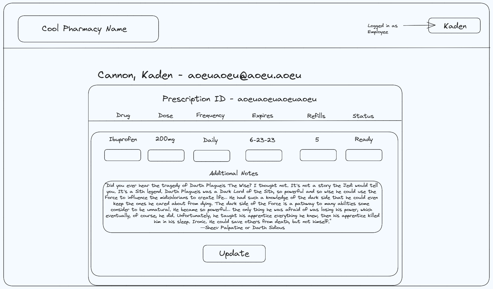
